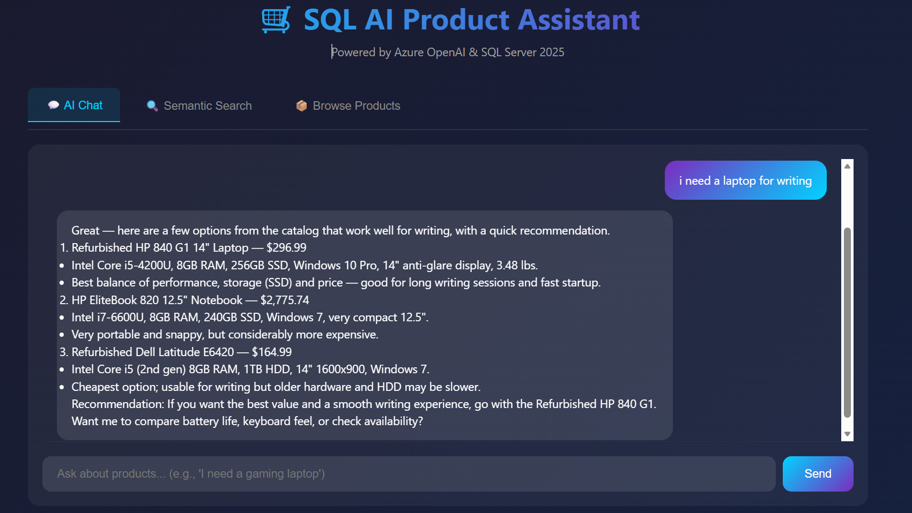

# Mission 4: Building a Full-Stack AI Application

This mission brings together everything you've learned to build a complete, production-ready application with a modern frontend powered by AI-enhanced backend APIs. You'll configure Data API Builder (DAB) to expose your database as REST/GraphQL endpoints and integrate it with either a .NET or Python backend.



## Overview

Your mission is to **configure DAB** to expose your product catalog, then run the full-stack application that combines:
- **DAB** for automatic REST/GraphQL APIs from your database
- **Backend API** (.NET or Python) for AI-powered chat and vector search endpoints
- **Frontend** for a user-friendly product search experience

## Learning Objectives

- **Configure Data API Builder**: Set up DAB to expose database entities as REST/GraphQL endpoints
- **Use Environment Variables**: Securely manage connection strings and API keys
- **Integrate Multiple Services**: Connect DAB, backend API, and frontend together
- **Test Full-Stack Applications**: Verify end-to-end functionality

## Prerequisites

1. Missions 1-3 completed (embeddings, RAG, and orchestration)
2. SQL Server with the `walmart_ecommerce_product_details` table and stored procedures:
   - `get_embedding` - Generates embeddings using AI_GENERATE_EMBEDDINGS()
   - `get_similar_items` - Performs vector similarity search
3. External Model `MyEmbeddingModel` created (from Mission 1)
4. Choose your backend:
   - **.NET**: .NET 9+ SDK installed
   - **Python**: Python 3.10+ with pip

---

## Project Structure

```
├── .env                    # Environment variables (connection strings, API keys)
├── README.md               # This file
├── dab-config.json         # DAB configuration
├── frontend/
│   └── index.html          # Single-page frontend application
├── dotnet/                 # .NET backend
│   ├── Program.cs          # .NET Minimal API with AI endpoints
│   ├── SqlAiApp.csproj     # Project file
│   ├── start.ps1           # Windows startup script
│   └── start.sh            # Linux/macOS startup script
└── py/                     # Python backend
    ├── main.py             # FastAPI with AI endpoints
    ├── requirements.txt    # Python dependencies
    ├── start.ps1           # Windows startup script
    └── start.sh            # Linux/macOS startup script
```

---

## Step 1: Install Data API Builder

```bash
dotnet tool install -g Microsoft.DataApiBuilder
```

Verify installation:
```bash
dab --version
```

---

## Step 2: Configure Environment Variables

Create or update the `.env` file in the `mission4` folder:

```properties
# Database connection
SERVER_CONNECTION_STRING=Server=YOUR_SERVER;Database=YOUR_DATABASE;Trusted_Connection=yes;TrustServerCertificate=yes;

# Azure OpenAI
AZURE_OPENAI_ENDPOINT=https://your-resource.openai.azure.com/
MODEL_API_KEY=your-api-key-here
```

---

## Step 3: Configure DAB 

The `dab-config.json` file is located in the `mission4` folder (not inside `dotnet` or `py`).

### Initialize DAB

```bash
cd mission4
dab init --database-type mssql --connection-string "@env('SERVER_CONNECTION_STRING')" --host-mode development
```

### Add the Products Entity

```bash
dab add Products --source "dbo.walmart_ecommerce_product_details" --permissions "anonymous:read"
```

### Configure CORS

Edit `dab-config.json` to allow requests from the .NET app:

```json
{
  "runtime": {
    "host": {
      "cors": {
        "origins": ["http://localhost:5001", "http://localhost:3000", "http://127.0.0.1:5001", "http://localhost:8000", "http://127.0.0.1:8000"],
        "allow-credentials": true
      },
      "mode": "development"
    }
  }
}
```

### Expected dab-config.json

Your final configuration should look similar to:

```json
{
  "$schema": "https://github.com/Azure/data-api-builder/releases/latest/download/dab.draft.schema.json",
  "data-source": {
    "database-type": "mssql",
    "connection-string": "@env('SERVER_CONNECTION_STRING')"
  },
  "runtime": {
    "rest": {
      "enabled": true,
      "path": "/api"
    },
    "graphql": {
      "enabled": true,
      "path": "/graphql",
      "allow-introspection": true
    },
    "host": {
      "cors": {
        "origins": ["http://localhost:5001", "http://localhost:3000", "http://127.0.0.1:5001", "http://localhost:8000", "http://127.0.0.1:8000"],
        "allow-credentials": true
      },
      "mode": "development"
    }
  },
  "entities": {
    "Products": {
      "source": {
        "object": "dbo.walmart_ecommerce_product_details",
        "type": "table"
      },
      "permissions": [
        {
          "role": "anonymous",
          "actions": ["read"]
        }
      ]
    }
  }
}
```

---

## Step 4: Run the Application

Choose either the **.NET** or **Python** backend based on your preference.

---

### Option A: .NET Backend

#### Using the startup script (recommended)

**Windows (PowerShell):**
```powershell
cd dotnet
.\start.ps1
```

**Linux/macOS (Bash):**
```bash
cd dotnet
chmod +x start.sh
./start.sh
```

This script:
1. Loads environment variables from `.env`
2. Starts DAB on port 5000
3. Starts the .NET API on port 5001
4. Opens the frontend in your browser

#### Run manually

**Terminal 1 - Start DAB:**
```bash
cd mission4
dab start
```

**Terminal 2 - Start .NET API:**
```bash
cd dotnet
dotnet run
```

**Browser:**
Open `http://localhost:5001/app`

---

### Option B: Python Backend

#### Install dependencies

```bash
cd py
pip install -r requirements.txt
```

#### Using the startup script (recommended)

**Windows (PowerShell):**
```powershell
cd py
.\start.ps1
```

**Linux/macOS (Bash):**
```bash
cd py
chmod +x start.sh
./start.sh
```

This script:
1. Loads environment variables from `.env`
2. Starts DAB on port 5000
3. Starts the FastAPI server on port 8000
4. Opens the frontend in your browser

#### Run manually

**Terminal 1 - Start DAB:**
```bash
cd mission4
dab start
```

**Terminal 2 - Start Python API:**
```bash
cd py
python -m uvicorn main:app --host 0.0.0.0 --port 8000 --reload
```

**Browser:**
Open `http://localhost:8000/app`

---

## Step 5: Test the Application

### Available Endpoints

#### .NET Backend (port 5001)

| Service | URL | Description |
|---------|-----|-------------|
| Frontend | http://localhost:5001/app | Product search UI |
| Swagger | http://localhost:5001/swagger | API documentation |
| DAB REST | http://localhost:5000/api/Products | Direct database access |
| DAB GraphQL | http://localhost:5000/graphql | GraphQL playground |

#### Python Backend (port 8000)

| Service | URL | Description |
|---------|-----|-------------|
| Frontend | http://localhost:8000/app | Product search UI |
| Swagger | http://localhost:8000/docs | API documentation |
| DAB REST | http://localhost:5000/api/Products | Direct database access |
| DAB GraphQL | http://localhost:5000/graphql | GraphQL playground |

### Test the Features

1. **Browse Products**: Click the "Browse Products" tab to see paginated results from DAB
2. **Vector Search**: Use the "Vector Search" tab to find products using semantic similarity
3. **AI Chat**: Ask the AI assistant questions like "I need a gaming laptop"

---

## Application Architecture

```
┌─────────────────┐     ┌─────────────────┐     ┌─────────────────┐
│    Frontend     │────▶│  Backend API    │────▶│   Azure OpenAI  │
│                 │     │ (.NET or Python)│     │                 │
└─────────────────┘     └────────┬────────┘     └─────────────────┘
                                 │
        ┌────────────────────────┼────────────────────────┐
        │                        │                        │
        ▼                        ▼                        ▼
┌─────────────────┐     ┌─────────────────┐     ┌─────────────────┐
│      DAB        │     │   SQL Server    │     │  Vector Search  │
│  (port 5000)    │────▶│   (Database)    │◀────│ (Stored Procs)  │
└─────────────────┘     └─────────────────┘     └─────────────────┘
```

**Port Summary:**
- **DAB**: Port 5000 (both backends)
- **.NET API**: Port 5001
- **Python API**: Port 8000

---

## Troubleshooting

### DAB won't start
- Check that `SERVER_CONNECTION_STRING` environment variable is set
- Verify the connection string format and server accessibility
- Ensure no other process is using port 5000

### Products not loading
- Verify DAB is running: `curl http://localhost:5000/api/Products`
- Check CORS configuration in `dab-config.json`
- Ensure the table `dbo.walmart_ecommerce_product_details` exists

### Vector search not working
- Verify the `get_similar_items` stored procedure exists
- Check that embeddings are populated in the database
- Ensure the external model `MyEmbeddingModel` is created
- Verify Azure OpenAI credentials are correct in `.env`

### Chat not responding
- Check Azure OpenAI endpoint and API key in `.env`
- Verify the `gpt-5-mini` model is deployed
- Check the backend logs for error messages

---

## Next Steps

After completing this mission, you have a production-ready, AI-powered full-stack application! Consider:

- **Add More Entities**: Expose additional tables or views through DAB
- **Implement Authentication**: Add Azure AD or JWT authentication to DAB
- **Deploy to Azure**: Use Azure Static Web Apps + Azure SQL + Azure Container Apps
- **Add Analytics**: Track usage patterns and popular queries
- **Open Hack**: Use this foundation for the Week 4 Open Hack challenge!

